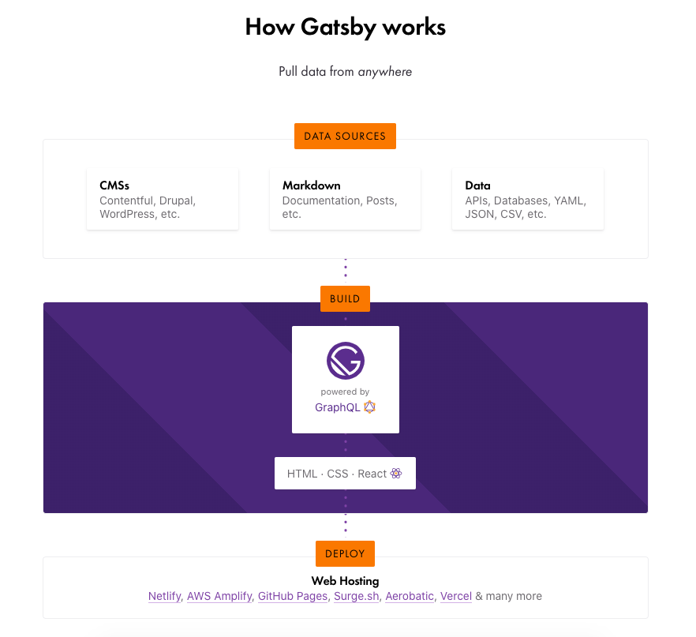

搭建个人博客是一件非常有趣的事，尽管博客的内容可能鲜有人问津，但你会感觉到拥有一片自己独立的空间，对于这片空间的每一处，你都是主宰。

曾经尝试过很多的博客网站和工具，比如 CSDN、博客园、Gihutb Pages + jekyll/hexo、著名的 wordpress 等。但它们都没能让我十分满意，最近整理了一下之前的博客，使用[`Gatsby`](https://www.gatsbyjs.org/)搭建了一个[全新风格的博客](http://picapica.space/)，并将其托管到了`Surge`上，整体来说，还是比较满意的。

那么什么是`Gatsby`，又为什么选择了`Gatsby`？用一句话来描述它：

> Gatsby is a free and open source framework based on React that helps developers build blazing fast websites and apps.

利用`Gatsby`，你可以非常方便地构建一个快速、全面和现代化的静态站点。同时，对于喜欢`React`的朋友来说将拥有舒适愉悦的开发体验。`Gatsby`的工作原理如下图所示：



OK，回到我们的题目 -- 一个简单的开始。`Gatsby`为我们提供了一个非常不错的博客启动器，你可以在[这里](https://github.com/gatsbyjs/gatsby-starter-blog)找到它。只要在命令行工具中执行下面这一行简单的代码，即可自动生成一个博客站点：

```shell
gatsby new my-blog-starter https://github.com/gatsbyjs/gatsby-starter-blog
```

然后切换到该项目目录下即可进行博客的开发工作了。

```shell
cd my-blog-starter
gatsby develop
```

此时站点将运行在`http://localhost:8000`，在浏览器中打开看看效果吧！

我们要做的起始工作就是如此的简单，关于`Gatsby`的安装和简单使用，请查看文档：https://www.gatsbyjs.org/docs/quick-start/ 

下一篇：TODO 网站的初始化修改、发布到Surge等。