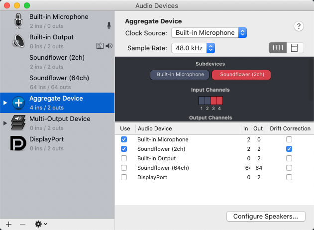
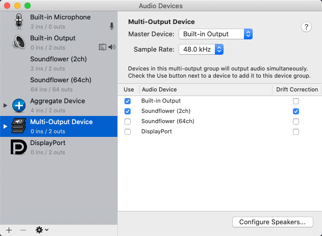
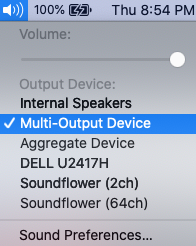
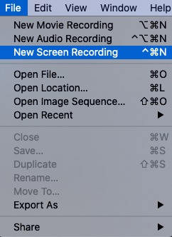
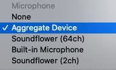
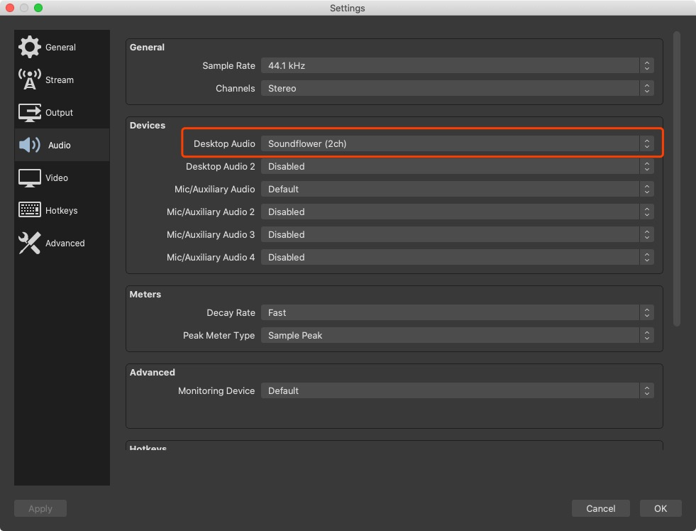
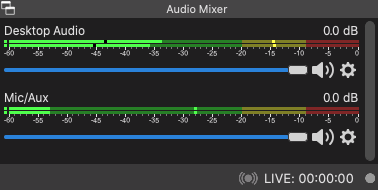

屏幕录制不是一件复杂的事情，有很多工具可以帮助我们去完成。在 Mac 系统上最简单的方案就是用自带的`QuickTime Player`，但是你会发现无法将系统声音一并录制，这是因为 Mac 系统并没有提供虚拟声卡，所以首先我们需要安装虚拟声卡工具。虚拟声卡工具有不少选择，比如 Audio Hijack、LookBack、Soundflower 等，这里我们选择的是开源免费的`Soundflower`。

## 安装 Soundflower

在[官网](https://rogueamoeba.com/freebies/soundflower/)上可以看到 Soundflower 的介绍：

> Soundflower is an open source kernel extension for MacOS, designed to create a virtual audio output device that can also act as an input.

它的源代码被托管在 Github 上：https://github.com/mattingalls/Soundflower ，在里面可以找到下载地址。

## 设置 Audio MIDI Setup

Soundflower 安装成功后，我们打开系统自带的 `Audio MIDI Setup` 工具，此时里面已经多了两个设备 --`Soundflower(2ch)`和`Soundflower(64ch)`。

首先，点击左下角的`+`号新建一个聚集设备（Aggregate Device），勾选内置麦克风（Built-in Microphone）和 Soundflower(2ch)。

然后，新建一个多输出设备（Multi-Output Device），勾选内置输出（Built-in Output）和Soundflower(2ch)。

注：关于 2ch 和 64ch 的区别还没搞得太清，网上有一种说法是，如果你不明白它们的区别，就使用 2ch。猜测 64ch 可能用于一些更专业的场景。

## QuickTime Player + Soundflower

现在我们就可以使用 QuickTime Player 来进行录屏了。首先我们需要将系统的音频输出设备设置为多输出设备，然后打开 QuickTime Player，点击左上角菜单栏中的文件 - 新建屏幕录制，通过调整屏幕录制中的选项，就可以完成不同的录制效果。

具体选项和效果对应如下：

* 内置麦克风：只录制麦克风的声音
* Soundflower (2ch)：只录制系统声音
* 聚合设备：同时录制麦克风声音和系统声音

## OBS + Soundflower

[OBS](https://obsproject.com/) 是一款开源免费的视频录制和直播推流工具，与 QuickTime Player 相比，它的可配置性更高，操作也并不复杂，受到众多up和主播的青睐。

如果你已经完成了上面的设置工作（声音输出设备依然选择多输出设备），那么只需要对 OBS 进行一项简单的配置即可完成对系统声音的内录。安装好 OBS 后，打开右下角的设置，在声音一栏中将桌面声音（Desktop Audio）设置为 Soundflower (2ch) 即可。

此时我们应该可以在 OBS 的声音混合器中看到有了桌面声音。

大功告成！

另附一个简单的 OBS 上手教程：

<iframe width="560" height="315" src="//player.bilibili.com/player.html?aid=21949746&bvid=BV1kW411K7HA&cid=36256331&page=1" scrolling="no" border="0" frameborder="no" framespacing="0" allowfullscreen> </iframe>

（看不到视频请访问：https://www.bilibili.com/video/BV1kW411K7HA?zw ）

我用 OBS 录了一段虎牙的直播视频，并用 FCPX 进行了简单的剪辑（掐头去尾）后上传到了b站，请大家欣赏！

<iframe width="560" height="315" src="//player.bilibili.com/player.html?aid=883374552&bvid=BV1wK4y1b7oB&cid=196417811&page=1" scrolling="no" border="0" frameborder="no" framespacing="0" allowfullscreen="true"> </iframe>

（看不到视频请访问：https://www.bilibili.com/video/BV1wK4y1b7oB/ ）

## Reference

[macOS 内录从工具到实战](https://sspai.com/post/36155)

[Mac 声音输入输出原理及虚拟声卡工具 Loopback 的使用](https://www.hanleylee.com/principle-of-sounds-transfer-in-macos.html)

[Github Issues: Difference between 2ch and 64ch](https://github.com/RogueAmoeba/Soundflower-Original/issues/53)

[【超详细教程】Mac如何用QuickTime录屏soundflower录制屏内外声音(附视频演示教程）](https://blog.csdn.net/AhoNan/article/details/82624000)
