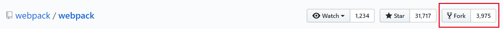

>   参考Github官方帮助文档：
>
>   [syncing-a-fork](https://help.github.com/articles/syncing-a-fork/)
>
>   [configuring-a-remote-for-a-fork](https://help.github.com/articles/configuring-a-remote-for-a-fork/)

一般情况下，当我们想在Github上为开源项目做贡献时，会首先将项目fork到自己的库中。那么应该如何同步这个库，使其与上游库保持最新呢？

其实非常简单，只要经过以下几步：

（这里我们以 [webpack](https://github.com/webpack/webpack) 的开源项目为例）

---

## \# 1 首先fork一个库



然后用你喜欢的方式将它克隆到本地。

---

## \# 2 配置fork仓库的远端仓库

当我们已经对自己fork的仓库做了一些修改，然而可能源仓库已经又有了其他的更新，我们想把这些更新同步到自己的fork仓库。这时，我们应该先配置自己fork仓库的远端仓库地址。

以命令行为例（windows可以使用git bash）：

先查看目前的配置：

```shell
$ git remote -v
origin  https://github.com/my_name/webpack.git (fetch)
origin  https://github.com/my_name/webpack.git (push)
```

添加新的上游仓库：

```shell
$ git remote add upstream https://github.com/webpack/webpack.git
```

确认添加成功：

```shell
$ git remote -v
origin  https://github.com/guitong/webpack.git (fetch)
origin  https://github.com/guitong/webpack.git (push)
upstream        https://github.com/webpack/webpack.git (fetch)
upstream        https://github.com/webpack/webpack.git (push)
```

---


## \# 3 可以进行同步了!

现在让我们开始同步fork仓库。

首先从上游仓库拉取分支和各自的提交。

```shell
$ git fetch upstream
 * [new branch]        0.10                  -> upstream/0.10
 * [new branch]        0.11                  -> upstream/0.11
 * [new branch]        0.8                   -> upstream/0.8
 * [new branch]        0.9                   -> upstream/0.9
 * [new branch]        1.0                   -> upstream/1.0
 * [new branch]        IgnorePluginHotfix    -> upstream/IgnorePluginHotfix
 * [new branch]        bugfix/hash-watch-warnings-errors -> upstream/bugfix/hash-watch-warnings-errors
 * [new branch]        ci/travis             -> upstream/ci/travis
 * [new branch]        deprecation/webpack-3 -> upstream/deprecation/webpack-3
 * [new branch]        feature/emoji_presets_to_options -> upstream/feature/emoji_presets_to_options
 * [new branch]        feature/jsonp-to-push -> upstream/feature/jsonp-to-push
 * [new branch]        feature/pure-module   -> upstream/feature/pure-module
 * [new branch]        feature/webpack_options_apply_coverage_increase -> upstream/feature/webpack_options_apply_coverage_increase
 * [new branch]        inline                -> upstream/inline
 * [new branch]        master                -> upstream/master
 * [new branch]        performance/parser    -> upstream/performance/parser
 * [new branch]        refactor/cleanups     -> upstream/refactor/cleanups
 * [new branch]        test/dependency-upgrade -> upstream/test/dependency-upgrade
 * [new branch]        use-set-in-chunks     -> upstream/use-set-in-chunks
 * [new branch]        webpack-1             -> upstream/webpack-1
 * [new branch]        webpack-2             -> upstream/webpack-2
```

现在upstream上所有的分支都已经拉取到本地了。`master` 上的提交保存在了本地分支，`upstream/master`。

如果我们想同步master分支，切换至本地`master`分支：

```shell
$ git checkout master
Switched to branch 'master'
```

将`upstream/master`分支数据合并至本地`master`分支：

```shell
$ git merge upstream/master
```

至此，我们的同步操作就完成了。

**Tip**: Syncing your fork only updates your local copy of the repository. To update your fork on GitHub, you must [push your changes](https://help.github.com/articles/pushing-to-a-remote).

(完)